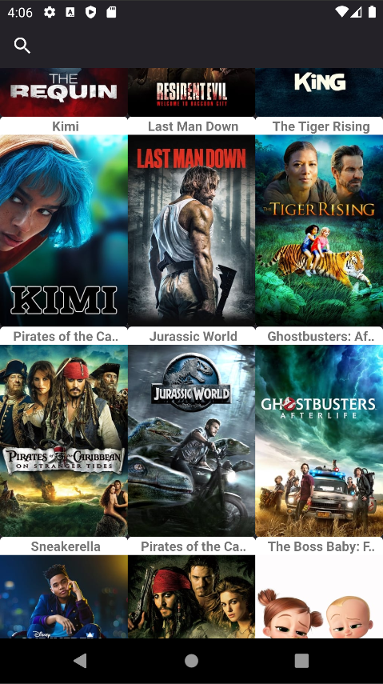
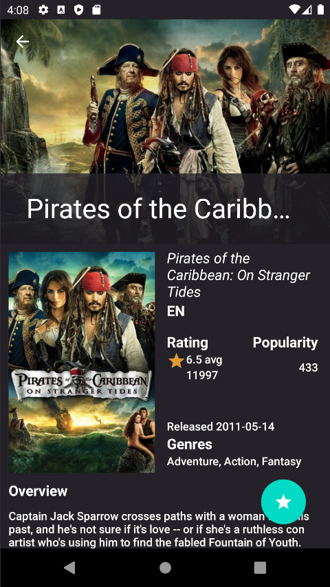
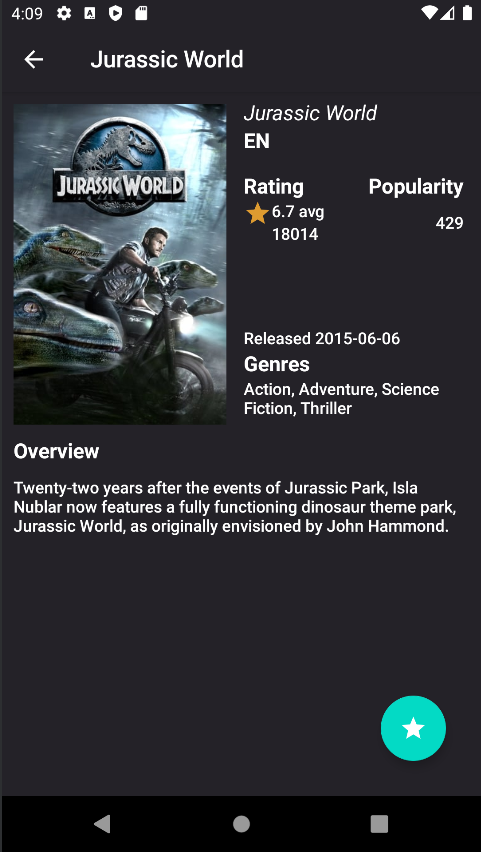
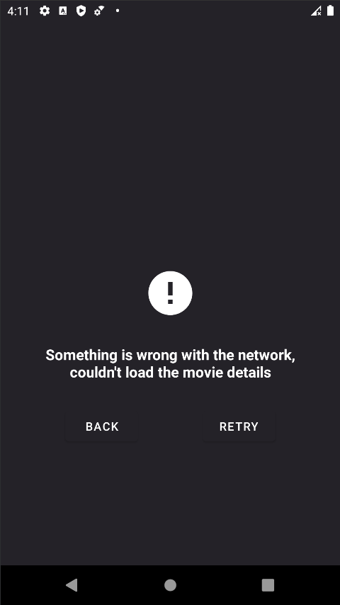

# TMDb-Kotlin-Challenge
The goal of the challenge was to develop an Android app that consumes <a href="https://www.themoviedb.org/documentation/api">The Movie Database API</a>.

## Features

- The main screen displays popular movies.
- Scrolling through the list loads more popular movies
- Search bar to filter the popular movies list
- Movies can be selected to display details
- The user can submit film ratings to TMDb.
- Cache of movie details to save on network usage
 
 ## Screenshots

    

    

    

    

    

